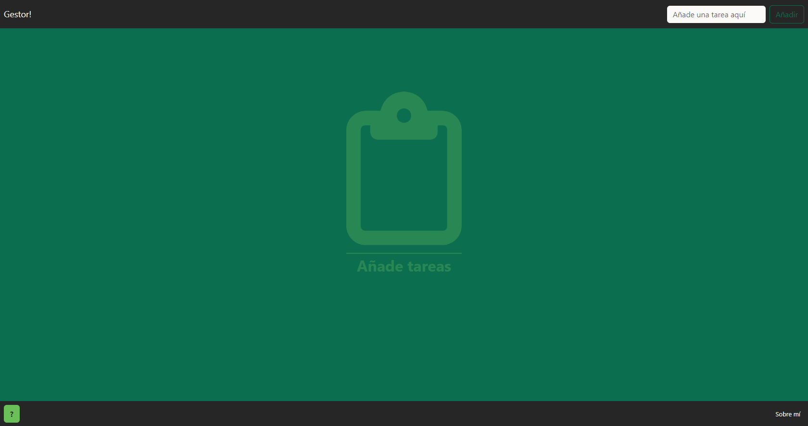
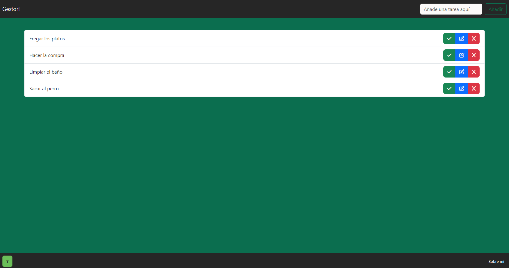
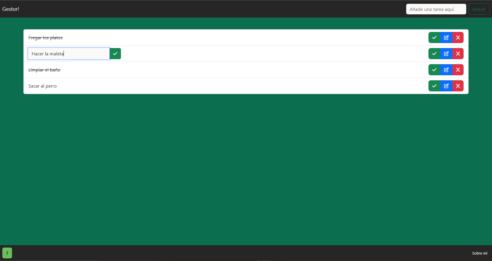

#Gestor!

Gestor! es una aplicación web minimalista para gestionar un listado con las tareas a realizar. Ha sido implementado en __Flask__.

Para añadir tareas hay que rellenar el formulario que se encuentra en la esquina superior derecha.

Cada tarea puede ser:

- **Marcada como completada**:

- **Editada**:

Y por último también puede ser **borrada***:

## Instalación

Hay que tener instalado Python 3 previamente.

Luego hay que instalar las dependencias con el siguiente comando:

> pip install -r requierements.txt

### Ejecución

Para ejecutar el programa simplemente tenemos que ejecutar el fichero _run.py_:

> python run.py

La aplicación se ejecutará en http://127.0.0.1:5000
